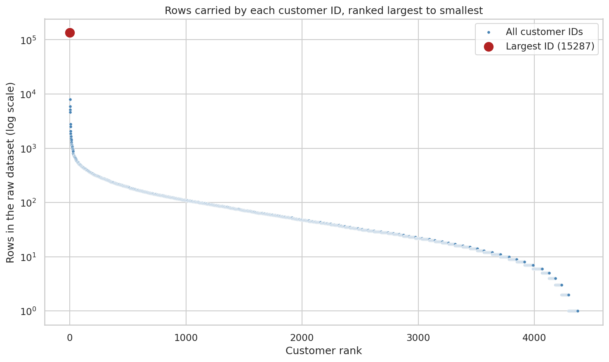
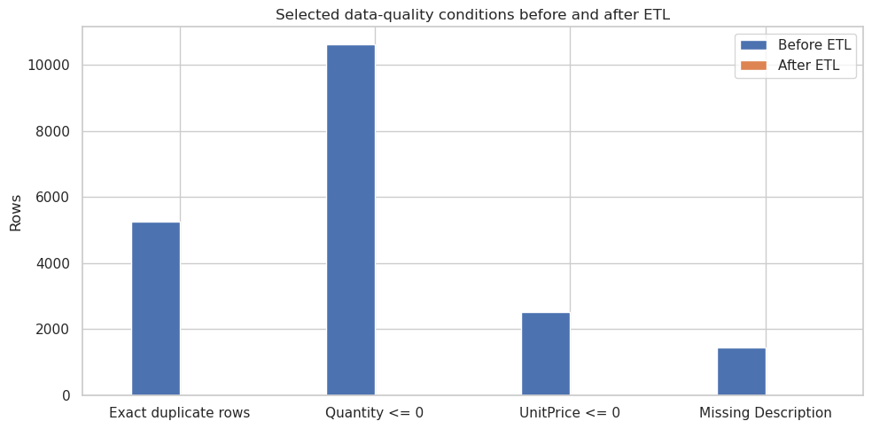
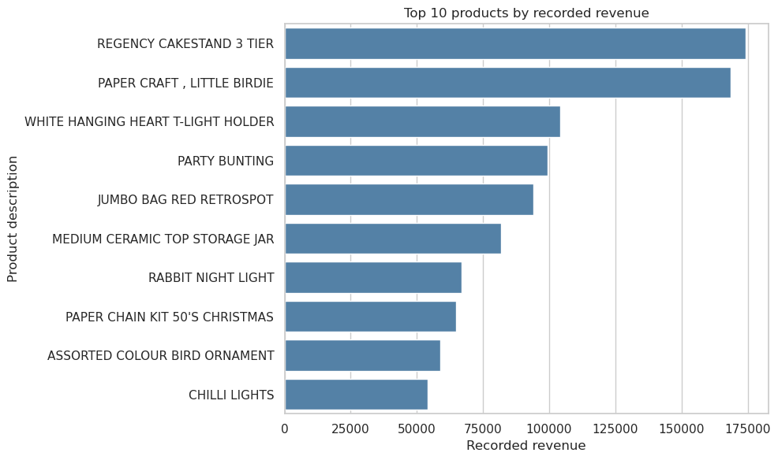
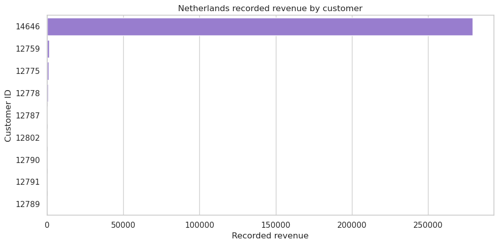
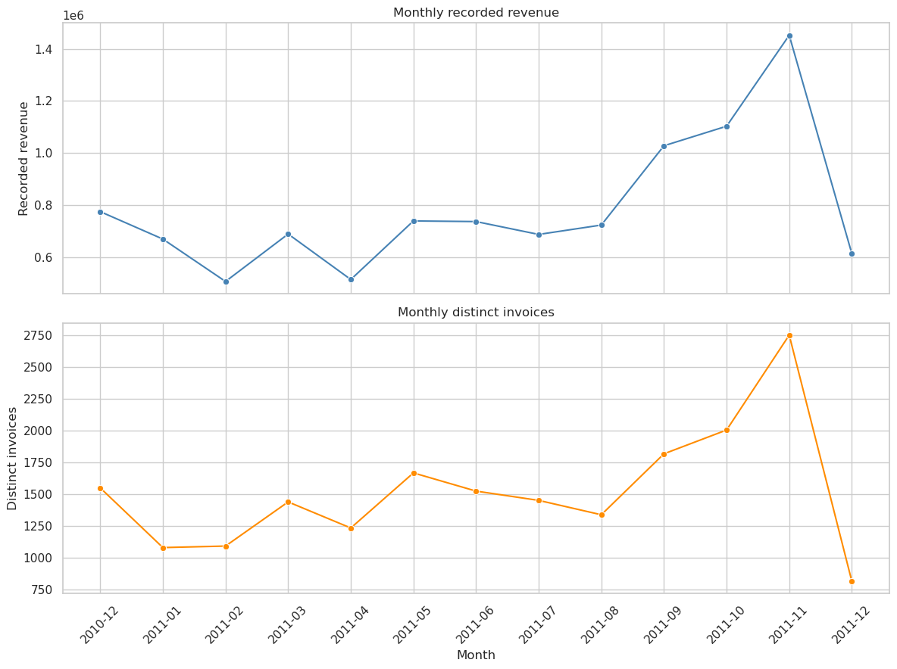
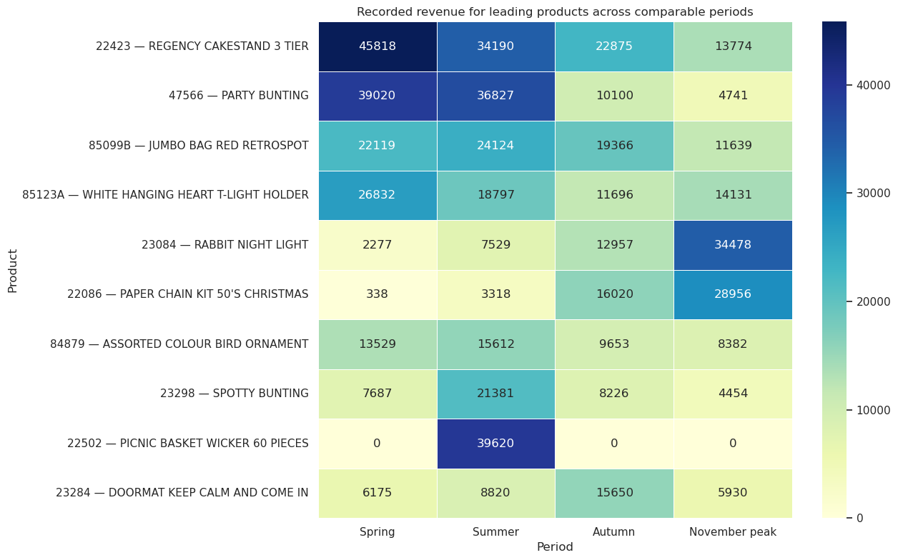

# Online Retail Transaction Analysis

<p>
  
  
  
  
  <a href="https://www.kaggle.com/datasets/abhishekrp1517/online-retail-transactions-dataset"></a>
</p>


This project investigates an Online Retail transaction dataset for an imagined Commercial Director of a UK-based online retailer. It began as a search for an unusually large customer, but careful exploration showed that the apparent customer was a data-version artefact. The project therefore changed direction: from chasing a ghost whale to investigating the product, market, customer-attribution, and time patterns that the verified data can actually support.

<details>
<summary><h1>📑 Table of Contents </h1></summary>

- [Prologue](#prologue)
  - [The original dataset choice](#the-original-dataset-choice)
  - [The apparent whale](#the-apparent-whale)
  - [The chase](#the-chase)
- [Introduction](#introduction)
  - [The contradiction](#the-contradiction)
  - [The provenance discovery](#the-provenance-discovery)
  - [The pivot](#the-pivot)
- [Business context](#business-context)
- [Business questions and hypothesis](#business-questions-and-hypothesis)
- [Project workflow](#project-workflow)
- [ETL and data quality](#etl-and-data-quality)
- [Visualisation rationale](#visualisation-rationale)
- [Findings](#findings)
- [Limitations and responsible interpretation](#limitations-and-responsible-interpretation)
- [AI assistance](#ai-assistance)
- [How to use this repository](#how-to-use-this-repository)
- [Tools, sources, books, and credits](#tools-sources-books-and-credits)
- [Assessment coverage](#assessment-coverage)
- [Ethical considerations](#ethical-considerations)
- [Unfixed bugs](#unfixed-bugs)
- [Development roadmap](#development-roadmap)

</details>

> 📘 **[Jump straight to "How to use this repository" →](#how-to-use-this-repository)**

## Prologue

I begin with an apology.

I set out on my first ever data analysis project with great hopes. A week before the project was due to start I engaged the excellent services of Anthropic's Claude AI to have a general conversation about this task. I told it what I was doing. I gave it the names of the possible dataset choices from Kaggle. My desire was to pick the messiest and most intriguing dataset upon which to flex my embryonic data wrangling muscles.

Claude's answer was clear – the datasets were all famous among DA students – and the Online Retail Dataset was the most awkward because it was full of data that was missing key elements from its entries. The others were somewhat flat and more straightforward. That messy one is the one for me, I thought.

### The original dataset choice

In the days leading up to the project start I began to explore this famous messy dataset using an Anaconda Jupyter notebook in my browser. I downloaded the dataset from the link to Kaggle provided by the LMS. To my naive eyes, it did indeed look messy, as well as vast. As I wrestled with understanding the shape and scope of this, my first dataset, I began to notice something. There was a huge shape in it, a customer that was massive and dominated all other customers in terms of purchasing patterns. I grew excited. I called this mystery customer – the whale.

### The apparent whale

I engaged Claude again to talk about this giant yet mysterious customer. Who could it be? What was the nature of its business? Why was it buying so much? Together we explored its patterns, across regions and nations; it appeared all over the place, but was mainly active in the UK. Claude suggested a wholesaler, as the dataset is famous for being full of wholesale accounts. I was suspicious – my whale was more special than that, surely? So I began the tedious task that would come to define my interaction with this dataset. I began to dig.

### The chase

I looked at what it was buying, when it was buying, how often it was buying, and most crucially, what price it was paying for what it was buying. The results showed a wholesaler was off the table – while the purchase history was widespread, it was also done at higher than average prices. Resellers live and die on margin; this could not be a simple wholesale account or reseller. It was international in scope and massive in volume.

I know of only one business activity that doesn't mind paying retail for fancy goods and bric-a-brac in volume – and that is the exhibition industry, in which I have some experience. Companies building events for giant global clients do not need to find margins – they suggest giving out 5000 party hats to delegates at the client's event, and the client says yes or no. The price of such things is rarely an issue. Event hosts regularly spend tens of thousands on trinkets to give away, or to attract visitors to their exhibition stands. This disregard for price point, the scattered international nature of purchases, the volume of purchases, and the regularity, convinced me I had found a commercial customer engaged in events and exhibitions. It was a customer who should be found, identified, and serviced more closely, as it could become a key driver of increased revenue going forward.

I was convinced. The evidence all aligned with my experience. Nothing could be found to knock down my theory. I was going to hunt this massive whale, reel it in, and walk away a hero who had found something the rest of the world had missed.

Up until it wasn't.


I grew suspicious.

## Introduction

The suspicion didn't fade – it sharpened, during the data-quality work that followed.

### The contradiction

A routine null-count on `CustomerID` came back at zero. Not low — zero.

That result didn't fit the dataset I thought I'd chosen. The Online Retail dataset is documented, everywhere it's discussed, as carrying a substantial amount of missing customer attribution. A file with no missing customer IDs at all needed explaining before I trusted a single customer-level conclusion built on top of it.

The question changed shape entirely, from:

> What kind of customer is `15287`?

to:

> Why does this file have one impossibly enormous customer exactly where the missing customer attribution was supposed to be?


### The provenance discovery

The checks that followed answered a far more important question than the one I started with:

- the documented standard version of this dataset carries **135,080 missing `CustomerID` values** across 541,909 rows;
- the project file stores `CustomerID` as `int64`, a type that cannot hold a null value at all;
- **135,101 rows** in the project file carry the single value `15287`;
- that figure is a **99.98% match** to the documented missing-value count; and
- a fresh download through the Code Institute-linked Kaggle source produced a file matching the existing one by MD5 checksum: `f89184594b02fe10c525c382d1065f4e`.

The most defensible reading is that an upstream cleaning step filled every missing `CustomerID` with one placeholder value, and that placeholder was `15287`. The whale was never a customer. It was the bucket every unattributed transaction had been swept into.



*Figure 1. Every other customer ID falls on a normal declining curve. `15287` sits alone, off the scale — not a customer, a ghost left behind by an upstream fill.*

Why that particular number was chosen, I do not know, and the record doesn't say. The dataset-level evidence — the counts, the type, the checksum — is verified. The story of how and when the fill happened upstream will remain a mystery.

What is not a mystery is the lesson that preconception can warp perception - and this very human trait can wreck any data analysis on the rocks if a sharp lookout is not kept.

My lesson is learned. Now what to do with it?


### The pivot

This discovery didn't just close a side investigation — it reversed my whole read of the project. I'd picked this dataset because I wanted messy customer attribution to wrestle with. The file I'd actually been given had hidden that mess by compressing it into a single, deceptively enormous identifier.

That's why the whale hunt stays in this README rather than getting quietly deleted. It's the clearest demonstration in the whole project of how fast early exploration can drag an analysis in the wrong direction, and how the most valuable finding isn't always a new segment — sometimes it's discovering that the premise underneath your investigation was never solid.

The whale hunt was over. What follows is the project that came after it: product performance, market value, customer patterns, and change over time, built on data I'd actually checked rather than a hypothesis I badly wanted to be true.


## Business context

The imagined client is the Commercial Director of a UK-based online retailer. The intended decisions concern:

- possible markets for growth;
- products or customer groups contributing strongly to recorded commercial value;
- signals where high activity does not match value; and
- patterns that deserve further investigation before a business decision.

The project does not assume that the busiest market is the most valuable. It compares transaction activity with recorded revenue, recorded revenue per invoice, customer activity, product range, and change over time.

## Business questions and hypothesis

### Core hypothesis

Transaction volume alone does not identify the strongest growth opportunity. Some lower-volume markets may generate greater recorded commercial value or show a more promising trend than busier markets.

### Focused questions

1. Which products generate the greatest recorded revenue?
2. Which products and markets are visible when the UK is not allowed to dominate the comparison?
3. Which markets are busy and which are valuable per transaction?
4. How does recorded revenue change over time?
5. Is the November increase driven by transaction volume or transaction value?
6. Which products show persistent or seasonal demand?
7. Is the November peak mainly domestic or international?

The Netherlands is treated as an investigation question within this hypothesis, not as a conclusion selected in advance.

## Project workflow

The active project is now two linear Jupyter Notebooks, run in order. I had to change from my single notebook plan because the exploration and investigation phase grew overly large, and I decided it was more important to get this 100% right than the actual analysis and visualisation that would come after it. All the pretty pictures in the are of no use if they paint the wrong thing.

The dataset took a lot of time and effort to understand, verify, and pat into shape. So I now have two clear notebooks - each dealing with its own aspect of the project.  Each notebook's later cells depend on objects created earlier in that notebook, and the second notebook depends on a file saved by the first — so both are designed to run top to bottom, in sequence:

```text
Notebook 1 — evaluation, clean, standardise
    raw extraction
    → first inspection
    → data-quality investigation
    → ETL decision checkpoint
    → cleaning and standardisation
    → validation and saved hand-off
        ↓
Notebook 2 — investigate, visualise
    reload and verify the Part 1 hand-off
    → business measures
    → focused visual analysis
    → findings, limitations, and next questions
```

The split exists so the messy investigative work — the whale, the data-quality digging, the cleaning decisions — sits in its own notebook, separate from the business-question analysis that depends on a clean, already-verified table.

The completed project board is available as supporting planning history:

[Project 01 board](https://github.com/users/financemccool/projects/1/views/1?layout_template=board)

The board is not an active product feature; it records the development route that led to the current project.

## ETL and data quality

### What one row represents

One row represents a product line within an invoice. It is not automatically one order, one customer, or one sale. This definition controls the later grouping and prevents transaction counts from being confused with row counts.

### Initial quality signals

The raw file contains 541,909 rows. The initial investigation displayed these quality signals:

- **5,268** exact duplicate rows;
- **10,624** rows with non-positive quantity;
- **9,288** cancellation-style rows with an invoice number beginning `C`;
- **1,336** negative-quantity rows without the `C` prefix;
- **2,517** rows with non-positive unit price;
- **1,454** missing descriptions; and
- **135,101** rows carrying the placeholder customer identifier `15287`.

These conditions overlap. They are not separate populations that can be added together without double-counting.

### Confirmed treatment

The primary paid-product analysis:

- keeps the raw table unchanged as an audit source;
- creates a working copy for standardisation;
- excludes exact duplicates;
- separates cancellation-style invoices from other negative-quantity adjustments;
- excludes non-positive prices;
- excludes documented operational, financial, adjustment, and voucher groups from product-level analysis;
- does not use a blanket non-numeric StockCode filter; and
- preserves excluded rows in a separate audit view.

Recorded line revenue is defined as:

```text
Quantity * UnitPrice
```

This is recorded revenue or line value. It is not profit, margin, or customer lifetime value.

The current Notebook 1 records a cleaned paid-product table of **522,540 rows** with complete `CustomerID` coverage within that cleaned scope. That makes customer-level grouping possible, but it does not identify customer type or business health.



*Figure 2. A compact before-and-after view of the documented ETL boundary. Notebook 1 remains the source for the underlying counts and decisions.*

### Incomplete December

The dataset ends on 9 December 2011. December is therefore incomplete and is not treated as a normal comparable month. The visible December fall is not described as a confirmed New Year decline.

## Visualisation rationale

Both notebooks follow a question-first visual method:

> *For every analysis cell, write the human question and metric in the Markdown above it.*
>
> *A chart is not a question nor an answer by itself.*
>
> *Question first → data shape → chart type → useful parameters → explain the result.*

```text
question → metric → chart type → visible result → restrained implication
```

The README shows only a small curated selection of charts. Notebook 2 remains the complete visual record for the business questions; Notebook 1 carries the equivalent ETL and data-quality charts.

| Question | Metric | Visual form | Why it matters |
|---|---|---|---|
| Which products lead? | Recorded revenue by product | Bar chart | Establishes product scale |
| Which markets lead? | Recorded revenue and invoice activity | Country comparison | Separates value from busyness |
| Is the Netherlands result broad? | Recorded revenue per invoice and customer share | Comparison bars and concentration chart | Tests whether the result is a market pattern or one relationship |
| How does activity change? | Monthly and weekly recorded revenue | Line charts | Shows the shape and planning lead time |
| Which products are seasonal? | Product revenue by analytical season | Heatmap | Separates persistent and concentrated demand |
| Is the peak domestic? | Monthly UK/international revenue share | Line chart | Shows the composition of the November peak |

### Why static charts, not interactive ones

I chose matplotlib and seaborn deliberately, not by default. Interactive libraries like Plotly add a layer of complexity — hover states, zoom, filter widgets — that brings nothing to this project. The Commercial Director this analysis is written for needs a defensible answer to a specific business question, not a toy to explore. Nobody reading this repository needs to hover over a bar to find out what it already says.

There's also a practical reason: GitHub's static notebook viewer, where this project will actually be read, renders interactive Plotly output as dead, unclickable HTML anyway. Keeping it would have meant carrying the dependency and the complexity for a feature that doesn't survive the one place this project gets viewed. Static, reproducible charts satisfy the assessment criterion for this project just as well, with none of that overhead.

Geographic mapping (choropleths via geopandas) was ruled out for the same reason: this dataset doesn't need a map to answer its questions, and adding one would have been complexity for its own sake.

## Findings

### UK dominance requires an international view

The United Kingdom dominates recorded revenue. UK-excluded views are therefore necessary when comparing international markets or products; otherwise smaller markets disappear behind domestic scale.



*Figure 3. Product scale in the cleaned paid-product scope.*

### Netherlands is a concentrated relationship signal

The Netherlands has the second-highest recorded revenue but only **93 distinct transactions** in the current Notebook 2 evidence. Customer `14646` contributes **98.3%** of Netherlands recorded revenue.

This is evidence of a concentrated relationship-level opportunity signal. It is not evidence that Dutch customers generally place high-value orders.



*Figure 4. The Netherlands result is concentrated in one customer relationship rather than spread evenly across the market.*

### November is a volume-led, mainly domestic peak

The monthly pattern shows an April trough, a May rebound, a fairly steady June-to-August period, and acceleration from September into November. November is the highest complete comparable month.

The increase is mainly associated with more invoices, quantity, and active customers rather than simply higher recorded revenue per invoice. The UK contributes about **88%** of November recorded revenue, while outside-UK markets contribute about **12%**.

This gives the Commercial Director a planning signal for stock, staffing, warehouse capacity, and campaign timing. It does not establish the cause of the increase.



*Figure 5. Monthly revenue is read alongside invoice activity, quantity, active customers, and recorded revenue per invoice.*

### The ramp begins before November

The weekly view shows the increase beginning in September rather than appearing suddenly in November. That creates a possible lead time for operational planning.

### Product demand has different seasonal shapes

The seasonal heatmap separates relatively persistent products from products concentrated in particular periods. Regency Cake Stand 3 Tier and White Hanging Heart T-Light Holder are comparatively persistent. Paper Chain Kit 50's Christmas strengthens into November, Rabbit Night Light rises into the November peak, and Picnic Basket Wicker 60 Pieces is concentrated in Summer.

These are descriptive stock and campaign clues, not causal explanations of customer motivation.



*Figure 6. Products have different persistent and seasonal patterns across the comparable periods.*

### Customer-level analysis needs attribution caution

Customer grouping is possible within the cleaned scope, but customer identifiers do not reveal whether a buyer is a consumer, retailer, wholesaler, or another type of organisation. The `15287` discovery makes this limitation especially important.

## Limitations and responsible interpretation

- Recorded revenue is not profit because product cost, margin, and shipping cost are absent.
- Timing patterns do not prove causation.
- Customer IDs do not reveal customer type or business health.
- December 2011 is incomplete.
- Country and customer concentration describe relationships but do not explain why they exist.
- Findings describe the cleaned paid-product scope, not every raw transaction-like row.
- The data does not contain shipping address, route, reseller, marketplace, marketing-campaign, or operational-capacity fields.

The project therefore does not claim to prove profitability, customer identity, drop-shipping, market causation, or the health of any customer's business.

## AI assistance

Generative AI supported key parts of the development process. AI was used to select this dataset (although it turned out to not be this version of the dataset ...). I enjoy long rambling discussions with Claude about topics, and take great delight in telling it is wrong, then proving that to it afterwards. I used Codex for structural advice, and my self built Gemini Gem tutor whom I call 'AI Kevin' after my first MasterClass tutor. To Kevin I would turn for advice including cell sequencing, code simplification, chart ideas, and possible narrative wording. I remained responsible at all times for the decisions, code, evidence, and conclusions in this project. Indeed I rejected the majority of AI suggestions as overly complex, out of context, or off topic.

I checked all suggestions against visible notebook tables, charts, counts, and calculations. I changed or rejected suggestions when the evidence did not support them. The important safeguard was to treat AI output as hypotheses or drafting assistance, not as findings to copy.

## How to use this repository

### Project files

- `Data_Sets/Online_Retail.csv` — raw project input
- `2_part_notebook/01_evaluation_clean_standardise.ipynb` — Part 1: dataset evaluation, data-quality investigation, cleaning, and validation
- `2_part_notebook/02_investigate_visualise.ipynb` — Part 2: business-question analysis and visualisation, reloading Part 1's saved output
- `outputs/cleaned_online_retail.csv` — cleaned paid-product hand-off, written by Part 1 and reloaded by Part 2
- `Images/Online_Retail_Analysis/` — reviewed chart images
- `Online_Retail_Analysis_Simple_Cell_Plan_20260825.md` — cell-by-cell design and preserved wording from the earlier single-notebook draft; retained as design history, not a description of the current two-notebook structure

### Running the notebooks

Run Part 1 first, from the beginning, in order — later cells depend on objects created earlier in the same notebook. Once Part 1 has finished and saved its output, run Part 2 in the same way. Both notebooks load and save paths relative to their own location inside `2_part_notebook/`, so Part 1 loads:

```python
pd.read_csv("../Data_Sets/Online_Retail.csv")
```

and saves:

```python
df_clean.to_csv("../outputs/cleaned_online_retail.csv", index=False)
```

Part 2 then reloads that same file:

```python
pd.read_csv(Path("../outputs/cleaned_online_retail.csv"), parse_dates=["InvoiceDate"])
```

The project runs in a local Python/Jupyter environment, using the pinned dependencies listed under Tools and libraries, below.

## Tools, sources, books, and credits

### Tools and libraries

- Python
- Jupyter Notebook
- Pandas
- NumPy
- Matplotlib
- Seaborn

The project deliberately uses reproducible static charts throughout — see [Why static charts, not interactive ones](#why-static-charts-not-interactive-ones) under Visualisation rationale for the reasoning.

### Dataset and provenance

The project uses the [Online Retail Transactions Dataset](https://www.kaggle.com/datasets/abhishekrp1517/online-retail-transactions-dataset) supplied through the Code Institute-linked Kaggle source.

The provenance investigation also compares the project file with the documented standard Online Retail version because the `CustomerID` treatment materially changes the interpretation of customer-level analysis.

### Credits

- [Code Institute](https://codeinstitute.net/) — initial project structure
- [Kaggle](https://www.kaggle.com/) — the dataset used in this project
- Anthropic Claude
- OpenAI Codex
- Google Gemini
- *Are Your Lights On?* (Gerald M. Weinberg, Donald C. Gause)
- *Data Analytics Made Accessible* (Anil Maheshwari)
- *Naked Statistics: Stripping the Dread from the Data* (Charles Wheelan)

## Assessment coverage

The project is designed to make the following visible:

- a clear business purpose and target audience;
- a justified dataset choice;
- Python and Pandas data preparation;
- documented ETL decisions and rationale;
- multiple plot types tied to business questions;
- evidence-based findings and limitations;
- a visible record of AI assistance and human verification; and
- a reproducible, clearly organised repository.

## Ethical considerations

This project uses the Online Retail Transactions Dataset, an anonymised set of historical UK online retail invoices. It contains no names, addresses, or other information capable of identifying an individual, and `CustomerID` is a numeric account code rather than a personal identifier. As a Code Institute student capstone built on a public, non-personal commercial dataset, this project raises no ethical concerns requiring further mitigation.

## Unfixed bugs

No unfixed bugs remain in either notebook at the time of submission.

## Development roadmap

**Challenges faced:**

- The project began as a single linear notebook. The data-quality investigation — the work that led to the CustomerID `15287` discovery — grew large enough that splitting the project into two notebooks (evaluation and cleaning, then business-question analysis) became the more honest structure. See [Project workflow](#project-workflow) for how that split works.
- A significant portion of early analytical effort went into investigating a customer that turned out to be a data-version artefact rather than a real business account. That discovery required reframing the whole analytical direction partway through the project rather than simply continuing the original plan. See [The provenance discovery](#the-provenance-discovery) and [The pivot](#the-pivot).
